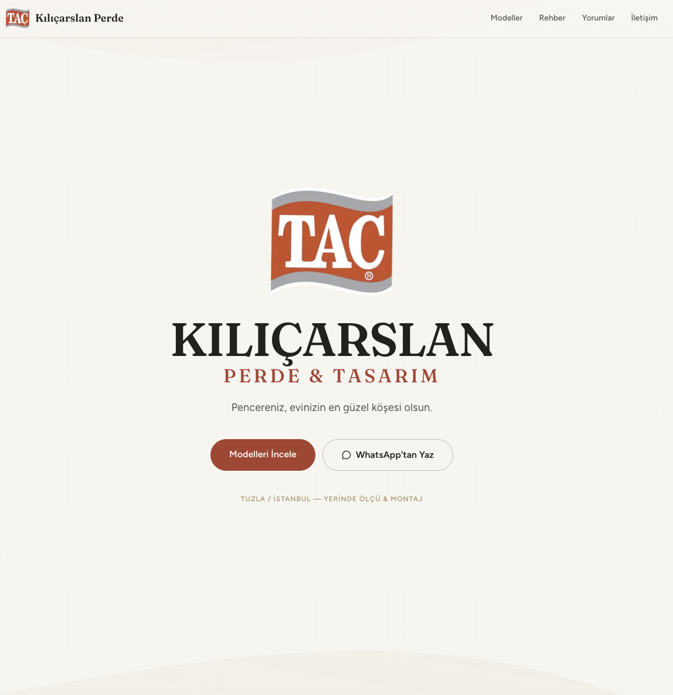
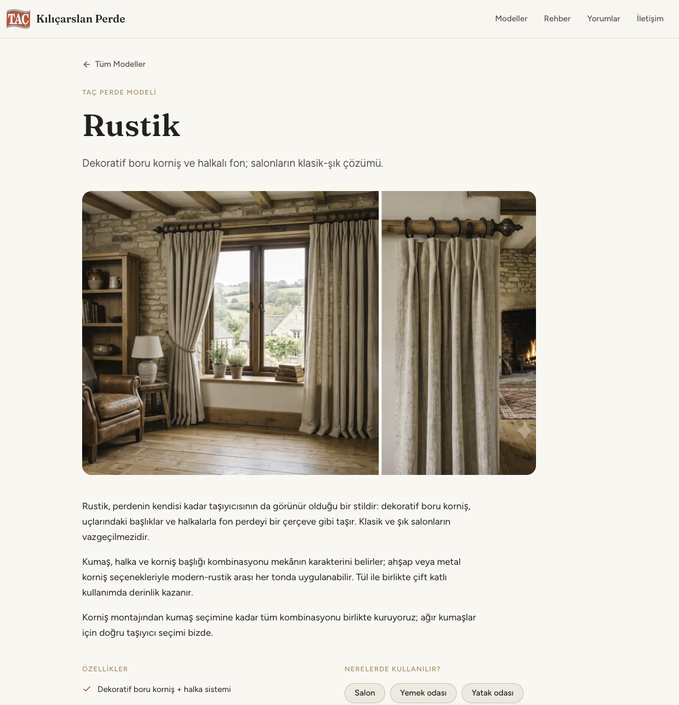
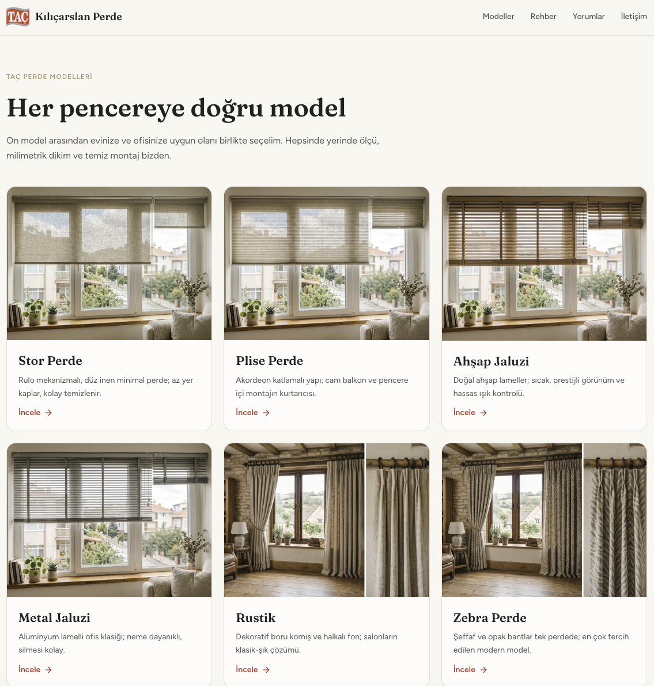
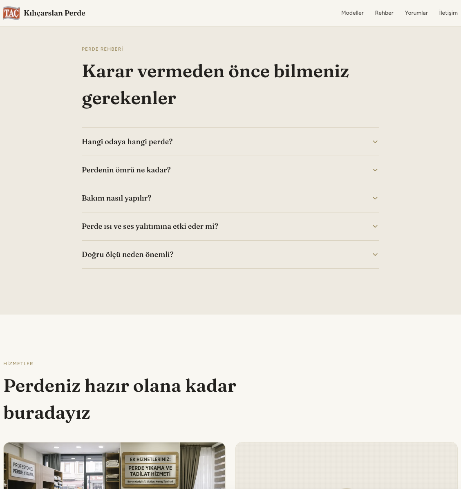
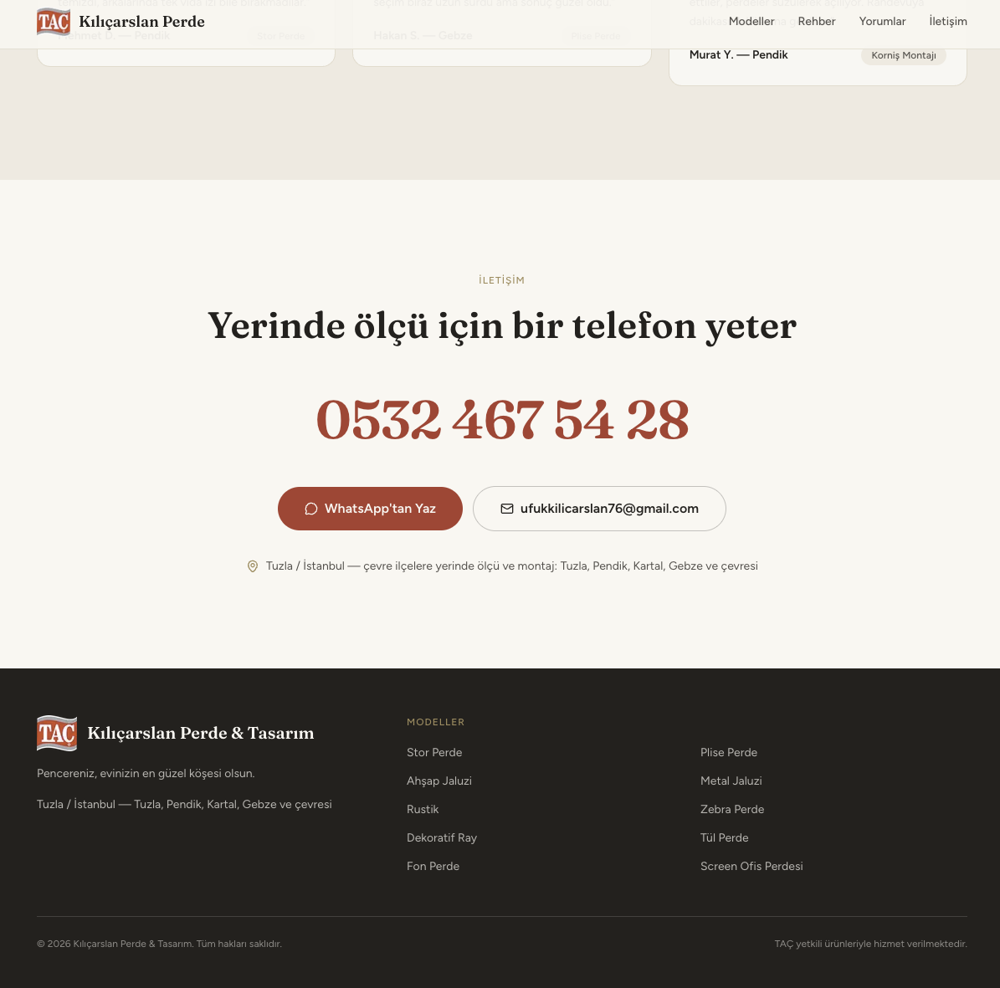
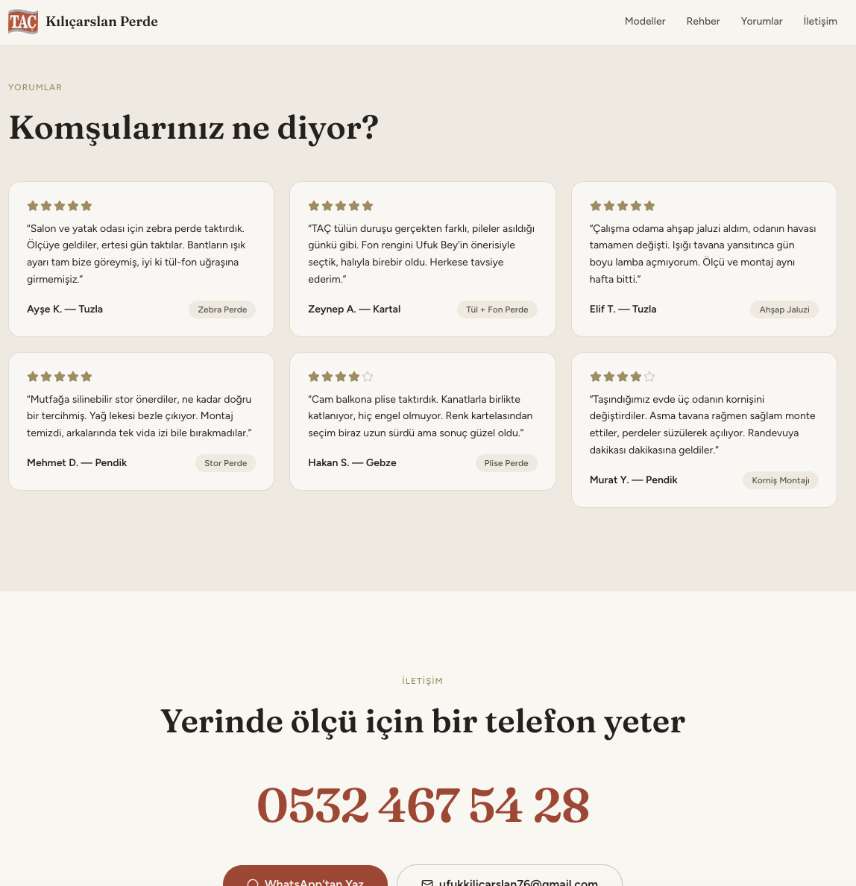

<div align="center">

<br />


<br /><br />

```
██╗  ██╗██╗██╗     ██╗ ██████╗ █████╗ ██████╗ ███████╗██╗      █████╗ ███╗   ██╗
██║ ██╔╝██║██║     ██║██╔════╝██╔══██╗██╔══██╗██╔════╝██║     ██╔══██╗████╗  ██║
█████╔╝ ██║██║     ██║██║     ███████║██████╔╝███████╗██║     ███████║██╔██╗ ██║
██╔═██╗ ██║██║     ██║██║     ██╔══██║██╔══██╗╚════██║██║     ██╔══██║██║╚██╗██║
██║  ██╗██║███████╗██║╚██████╗██║  ██║██║  ██║███████║███████╗██║  ██║██║ ╚████║
╚═╝  ╚═╝╚═╝╚══════╝╚═╝ ╚═════╝╚═╝  ╚═╝╚═╝  ╚═╝╚══════╝╚══════╝╚═╝  ╚═╝╚═╝  ╚═══╝
```

### **Kılıçarslan Perde & Tasarım** — Pencereniz, evinizin en güzel köşesi olsun.

**TAÇ Perde Modelleri** · Yerinde Ölçü ve Montaj · Tuzla, Pendik, Kartal ve çevresi.

[🚀 Canlı Demo](https://kilicarslanperdetasarim.vercel.app) · [☁️ Vercel](https://vercel.com)

</div>

---

## ✦ Genel Bakış

**Kılıçarslan Perde & Tasarım**, bir yerel zanaat işletmesi için tasarlanmış modern, premium ve mobil öncelikli bir **vitrin sitesidir**. Site, kullanıcılara sunulan perde modellerini, sağlanan hizmetleri ve müşteri yorumlarını sade ve şık bir arayüzle sunar.

> **E-ticaret veya karmaşık formlar içermez.** Kullanıcı doğrudan telefonla aramaya veya WhatsApp'tan ulaşmaya teşvik edilir. İşletmenin sıcak ve güvenilir yüzünü, dijital dünyanın en modern teknolojileriyle harmanlar.

<div align="center">


</div>

---

## ⚡ Öne Çıkan Özellikler

| Özellik | Açıklama |
|--------|----------|
| 🎨 **Atölye Kırmızısı** | TAÇ logosundan ilham alan, "keten" zemin ve antrasit metinlerle dengelenmiş premium renk paleti. |
| 🎭 **Perde Açılışı Animasyonları** | Sayfa geçişlerinde ve bölümlerde, iki yana açılan perde hissi veren zarif Framer Motion animasyonları. |
| 📱 **Mobil Öncelikli (Mobile-First)** | Trafiğin %90'ının mobilden geleceği varsayılarak tasarlanmış, başparmak dostu navigasyon ve sabit iletişim çubuğu (Sticky Contact Bar). |
| 🚀 **Next.js Statik Üretim (SSG)** | Sıfır veritabanı. Tüm içerik TypeScript dosyalarından okunur ve anında yüklenen statik HTML olarak derlenir. |
| 🪟 **Kapsamlı Ürün Kataloğu** | Stor, Plise, Jaluzi, Rustik, Tül ve Fon dahil olmak üzere zengin ürün kartları ve detay sayfaları. |
| ✨ **Markalı Placeholder** | Görseller yüklenene kadar boş gri kutular yerine TAÇ markalı, keten dokulu şık yer tutucular (placeholder) kullanılır. |

<div align="center">


</div>

---

## 🗂️ Veri Yapısı (Sıfır Bağımlılık)

Projede CMS, veritabanı veya harici API yoktur. Bilinçli olarak **sıfır dış bağımlılık** ile tasarlanmıştır. Tüm veriler `src/data/` klasöründeki TypeScript (`.ts`) dosyalarında tip güvenli bir şekilde saklanır.

Müşteri yeni bir ürün veya görsel eklemek istediğinde kod değişikliğine gerek kalmadan sadece ilgili dosyaya görseli koyup veriyi güncellemesi yeterlidir.

---

## 📸 Referanslar & Rehber

<div align="center">


</div>

---

## 🛠️ Teknoloji

```
Çatı         →  Next.js 14 (App Router) · TypeScript · React
Stil         →  Tailwind CSS · Özel tasarım token'ları
Animasyon    →  Framer Motion · CSS Keyframes (Marquee)
Fontlar      →  Fraunces (Display) · Figtree (Body)
İkonlar      →  Lucide React
Dağıtım      →  Vercel
```

---

## 📐 Proje Yapısı

```
kilicarslanperdetasarim/
├── public/
│   └── images/              # Marka logoları, ürün ve hizmet fotoğrafları
├── src/
│   ├── app/
│   │   ├── modeller/        # Dinamik ürün sayfaları ([slug])
│   │   ├── layout.tsx       # Kök düzen, metadata, fontlar
│   │   └── page.tsx         # Ana sayfa
│   ├── components/
│   │   ├── hero/            # Açılış sekansı ve kayan yazı
│   │   ├── layout/          # Navbar, Footer, Mobil Sticky Contact Bar
│   │   ├── motion/          # Yeniden kullanılabilir animasyon wrapper'ları
│   │   ├── products/        # Ürün kartları ve grid
│   │   └── sections/        # Hakkımızda, Hizmetler, Yorumlar, Rehber
│   ├── data/                # Statik veriler (products.ts, services.ts, vb.)
│   └── lib/                 # Utils ve Framer Motion varyantları
└── tailwind.config.ts       # Tasarım sistemi token'ları
```

---

## 🚀 Kurulum

### Gereksinimler
- Node.js `>= 18`

```bash
# Klonla
git clone https://github.com/kutluhangil/kilicarslanperdetasarim.git
cd kilicarslanperdetasarim

# Bağımlılıklar
npm install

# Geliştirme sunucusunu başlat
npm run dev        # http://localhost:3000

# Üretim sürümünü derle
npm run build
```

---

<div align="center">

Tuzla'daki evler için ❤️ ile yapıldı · **[kutluhangil](https://github.com/kutluhangil)**

<br />

</div>
